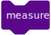

# QScratch

An educational extension of Scratch for intuitive introduction to
**quantum mechanics concepts**.

<center>

</center>

QScratch is an open-source educational tool that extends the visual
programming environment Scratch to model foundational quantum mechanics
principles such as **superposition**, **entanglement**, and
**measurement** using intuitive block-based programming. It allows
learners and educators to interactively explore complex quantum
behaviors without requiring advanced programming experience or deep
prior knowledge of physics.

## Features

QScratch introduces quantum concepts through new Scratch block
categories, enabling interactive simulation of:

-   **Superposition**: Allows variables of sprites to exist in
    multiple possible states concurrently.
-   **Entanglement**: Correlates the states of two sprites so that a
    measurement on one affects the other.
-   **Measurement**: Collapses superposed or entangled states into a
    single observable outcome.

<table>
  <tr>
    <td align="center" valign="center" colspan="1">
      <b>Superposition</b>
    </td>
    <td align="center" valign="center" colspan="1">
      <b>Entanglement</b>
    </td>
    <td align="center" valign="center" colspan="1">
      <b>Measurement</b>
    </td>
  </tr>
  <tr>
    <td align="center" valign="center">
      <br>
      <br>
      <br>
      
    </td>
    <td align="center" valign="center">
      <br>
      <br>
      <br>
      
    </td>
    <td align="center" valign="center">
      <br>
      
    </td>
  </tr>
</table>


The blocks are designed to be simple, visual, and pedagogically
effective, making STEM learning accessible to a wide range of students.

## Quick Start

The fastest way to start using QScratch is to visit the official hosted page:

🔗 https://marcosrv-ull.github.io/QScratch/

There you will find:

- QScratch fully hosted and ready to use, with no installation required.
- The new Quantum category integrated into the Scratch environment.
- Interactive blocks to explore superposition, entanglement, and measurement.
- Practical examples to start experimenting with quantum concepts in a visual and intuitive way.

Start programming and discover how quantum principles work—just drag and drop blocks!

## Installation

### Clone the Repository

``` bash
git clone https://github.com/marcosrv-ULL/QScratch.git
cd QScratch
```

## License

This project is released under an open-source license. See the LICENSE
file for details.

## Contributing

Contributions are welcome. Please follow the standard GitHub workflow:

1.  Fork the repository
2.  Create a feature branch
3.  Commit your changes
4.  Open a Pull Request

## Citation

If you use QScratch in research or teaching, please cite the
[corresponding publication](https://link.springer.com/article/10.1140/epjqt/s40507-025-00314-9) describing the tool and
its educational validation.

> Escanez-Exposito, Daniel, Marcos Rodriguez-Vega, Carlos Rosa-Remedios, and Pino Caballero-Gil. "QScratch: introduction to quantum mechanics concepts through block-based programming." EPJ Quantum Technology 12, no. 1 (2025): 12.

```bibtex
@article{escanez2025qscratch,
  title={QScratch: introduction to quantum mechanics concepts through block-based programming},
  author={Escanez-Exposito, Daniel and Rodriguez-Vega, Marcos and Rosa-Remedios, Carlos and Caballero-Gil, Pino},
  journal={EPJ Quantum Technology},
  volume={12},
  number={1},
  pages={12},
  year={2025},
  publisher={Springer}
}
```
